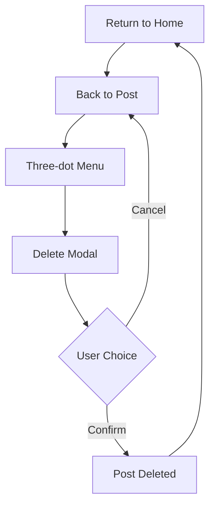

## 1. Product Overview
Fairy is a social media application that enables users to share content and interact with posts. The app focuses on providing a clean, modern interface with intuitive post management features including a prominent post deletion confirmation modal.

The app targets social media users who want a streamlined platform for content sharing with visual appeal and easy navigation.

## 2. Core Features

### 2.1 User Roles
| Role | Registration Method | Core Permissions |
|------|---------------------|------------------|
| Normal User | Email/Social registration | Create posts, comment, react, delete own posts |
| Visitor | Browse without registration | View public posts, read comments |

### 2.2 Feature Module
Fairy social media app consists of the following main pages:
1. **Home page**: trending section, post feed, navigation header.
2. **Post detail page**: full post content, comments section, interaction buttons.
3. **User profile page**: user information, post history, follower count.

### 2.3 Page Details
| Page Name | Module Name | Feature description |
|-----------|-------------|---------------------|
| Home page | Header navigation | Display app logo "Fairy" with fairy icon, search, notifications, and user avatar icons |
| Home page | Trending section | Show trending posts with flame icon and pink/magenta styling |
| Home page | Post feed | Display user posts with username, avatar, timestamp, and interaction options |
| Post detail | Post content | Show full post with image/video content and engagement metrics |
| Post detail | Comments section | Display comment count in purple pill and list user comments |
| Post detail | Action bar | Provide message, reaction, and sharing options with icon buttons |
| Post detail | Delete confirmation modal | Show "You wanna delete this post?" with delete/cancel options in centered white rounded container |
| User profile | Profile header | Display user avatar, username, bio, and follower statistics |
| User profile | Post grid | Show user's published posts in grid layout |

## 3. Core Process
User Flow for Post Management:
1. User browses home feed and sees trending posts
2. User opens a post to view details
3. User clicks three-dot menu on their own post
4. System shows delete confirmation modal
5. User confirms deletion or cancels
6. Post is removed from feed upon confirmation

## 4. User Interface Design

### 4.1 Design Style
- **Primary colors**: Pink/magenta for trending and action elements, green for fairy icon
- **Secondary colors**: Gray for secondary text, purple for comment pills, red for delete actions
- **Button style**: Rounded pills with icon and text combinations
- **Font**: Modern sans-serif with clear hierarchy - bold for titles, regular for content
- **Layout**: Card-based post design with rounded corners and white backgrounds
- **Icons**: Colorful emoji-style icons mixed with minimalist line icons

### 4.2 Page Design Overview
| Page Name | Module Name | UI Elements |
|-----------|-------------|-------------|
| Home page | Header | White rounded header with "Fairy" text, green fairy icon, colorful tool icons on right |
| Home page | Trending | Pink "Trending" text with orange flame emoji, gray dot separator |
| Post card | User header | Circular avatar, black username "Freda Da. pepper", gray timestamp "15hrs" |
| Post card | Action buttons | Pink "Acid Enemy" text with character icon, three-dot menu |
| Delete modal | Confirmation | Centered white rounded rectangle, bold black "You wanna delete this post?", gray subtext, red delete button, gray cancel button |
| Action bar | Bottom actions | Gray "Send me message" pill button, colorful reaction icons (fire, person, cup, camera, face) |
| Comments | Count display | Purple rounded pill with "812 comments" in white text, speech bubble tail |

### 4.3 Responsiveness
Desktop-first design approach with mobile adaptation. Touch interaction optimization for mobile devices with appropriately sized tap targets and swipe gestures for navigation.