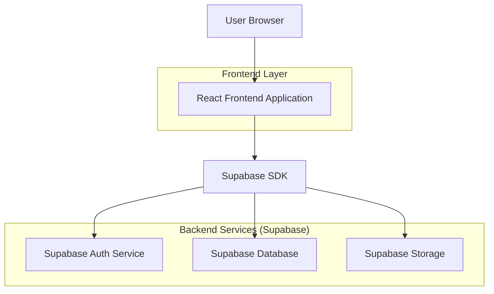
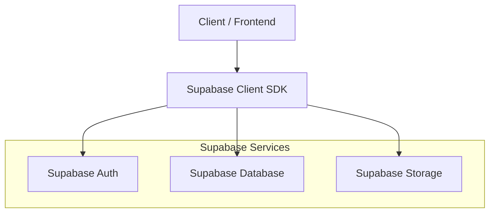
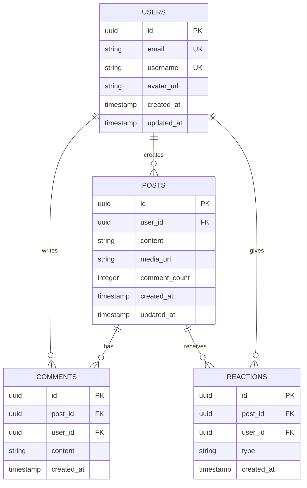

## 1. Architecture design



## 2. Technology Description
- Frontend: React@18 + tailwindcss@3 + vite
- Initialization Tool: vite-init
- Backend: Supabase (Authentication, Database, Storage)
- State Management: React Context API
- UI Components: Custom components with Tailwind CSS

## 3. Route definitions
| Route | Purpose |
|-------|---------|
| / | Home page, displays trending posts and feed |
| /post/:id | Post detail page, shows full post with comments |
| /profile/:username | User profile page, displays user information and posts |
| /login | Login page, user authentication |
| /register | Registration page, new user signup |

## 4. API definitions

### 4.1 Post Management API

Delete post
```
DELETE /api/posts/:id
```

Request headers:
| Header | Value | Description |
|--------|-------|-------------|
| Authorization | Bearer {token} | User authentication token |

Response:
| Param Name | Param Type | Description |
|------------|-------------|-------------|
| success | boolean | Deletion status |
| message | string | Response message |

### 4.2 User Authentication API

Login user
```
POST /api/auth/login
```

Request:
| Param Name | Param Type | isRequired | Description |
|------------|-------------|-------------|-------------|
| email | string | true | User email address |
| password | string | true | User password |

Response:
| Param Name | Param Type | Description |
|------------|-------------|-------------|
| user | object | User data object |
| token | string | Authentication token |

## 5. Server architecture diagram


## 6. Data model

### 6.1 Data model definition


### 6.2 Data Definition Language

Users Table
```sql
-- create table
CREATE TABLE users (
    id UUID PRIMARY KEY DEFAULT gen_random_uuid(),
    email VARCHAR(255) UNIQUE NOT NULL,
    username VARCHAR(50) UNIQUE NOT NULL,
    password_hash VARCHAR(255) NOT NULL,
    avatar_url TEXT,
    created_at TIMESTAMP WITH TIME ZONE DEFAULT NOW(),
    updated_at TIMESTAMP WITH TIME ZONE DEFAULT NOW()
);

-- create index
CREATE INDEX idx_users_email ON users(email);
CREATE INDEX idx_users_username ON users(username);
```

Posts Table
```sql
-- create table
CREATE TABLE posts (
    id UUID PRIMARY KEY DEFAULT gen_random_uuid(),
    user_id UUID REFERENCES users(id) ON DELETE CASCADE,
    content TEXT,
    media_url TEXT,
    comment_count INTEGER DEFAULT 0,
    created_at TIMESTAMP WITH TIME ZONE DEFAULT NOW(),
    updated_at TIMESTAMP WITH TIME ZONE DEFAULT NOW()
);

-- create index
CREATE INDEX idx_posts_user_id ON posts(user_id);
CREATE INDEX idx_posts_created_at ON posts(created_at DESC);

-- grant permissions
GRANT SELECT ON posts TO anon;
GRANT ALL PRIVILEGES ON posts TO authenticated;
```