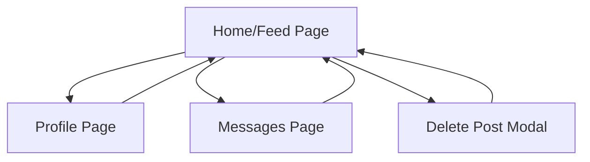

## 1. Product Overview
Fairy is a social media application designed for creative expression and community interaction. The app provides users with a platform to share content, engage with trending topics, and connect with others through an intuitive, visually appealing interface.

The app targets creative individuals and social media enthusiasts who value both aesthetic design and functional simplicity in their social networking experience.

## 2. Core Features

### 2.1 User Roles
| Role | Registration Method | Core Permissions |
|------|---------------------|------------------|
| Normal User | Email registration | Can create posts, view feed, interact with content, send messages |
| Premium User | Subscription upgrade | Enhanced visibility, advanced features, priority support |

### 2.2 Feature Module
Our Fairy social media app consists of the following main pages:
1. **Home/Feed page**: trending section, post feed, bottom navigation, delete post modal
2. **Profile page**: user information, posts, settings
3. **Messages page**: conversation list, chat interface

### 2.3 Page Details
| Page Name | Module Name | Feature description |
|-----------|-------------|---------------------|
| Home/Feed | Top app bar | Display fairy icon, app name "Fairy", navigation icons (art tool, character face, bell, search) |
| Home/Feed | Trending section | Show "Trending" with flame icon, display trending content |
| Home/Feed | Post feed | Display user posts with username, timestamp, action buttons, comment count |
| Home/Feed | Delete post modal | Show confirmation dialog with "Delete" and "Cancel" options |
| Home/Feed | Bottom navigation | Provide home, chat, circle, paw, profile icons for navigation |
| Home/Feed | Action buttons | Include "Send me message" button, comment count pill |
| Profile | User info | Display user details, post count, follower count |
| Profile | Posts grid | Show user's posts in grid layout |
| Messages | Conversation list | Display active conversations with other users |
| Messages | Chat interface | Show message history and input field for new messages |

## 3. Core Process
Users begin their journey on the Home/Feed page where they can browse trending content and user posts. They can interact with posts through comments and messages. When users want to delete their own posts, a confirmation modal appears to prevent accidental deletion. Navigation between different sections is handled through the bottom navigation bar.

## 4. User Interface Design

### 4.1 Design Style
- **Primary colors**: Black for primary text, white for backgrounds
- **Accent colors**: Purple (#8B5CF6) for trending and comments, red (#EF4444) for delete actions, orange for flame icon
- **Secondary colors**: Gray (#6B7280) for timestamps and secondary text
- **Button style**: Rounded pills with light backgrounds, red text for destructive actions
- **Font**: Modern sans-serif, medium-bold for headers, regular for body text
- **Layout**: Card-based design with rounded corners, clean dividers
- **Icons**: Minimalist outlined style, circular/rounded shapes

### 4.2 Page Design Overview
| Page Name | Module Name | UI Elements |
|-----------|-------------|-------------|
| Home/Feed | Top app bar | Left-aligned fairy icon, "Fairy" text in black medium-bold, right-side icon cluster with art tool, character face, bell, search |
| Home/Feed | Trending section | Pink/purple "Trending" text with orange flame emoji, gray dot separator |
| Home/Feed | Post card | White background with rounded corners, user header with bold name and gray timestamp, red "Acid Enemy" action text |
| Home/Feed | Delete modal | Centered white card with rounded corners, black bold title, gray subtitle, red "Delete" button with divider, black "Cancel" button |
| Home/Feed | Action bar | Right-aligned "Send me message" pill button with icon, purple "812 comments" pill with speech bubble tail |
| Home/Feed | Bottom nav | Five circular icons in a row: house, chat bubble, circle, paw, person silhouette |

### 4.3 Responsiveness
The app follows a mobile-first design approach with responsive layouts that adapt to different screen sizes. Touch interactions are optimized for mobile devices with appropriately sized touch targets and gesture support.