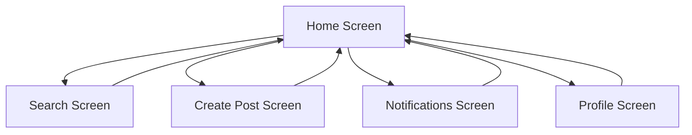

## 1. Product Overview
A social media application with a clean home screen featuring a bottom navigation bar containing 5 icons for seamless user navigation. The app provides an intuitive interface for users to browse content and access different sections quickly.

## 2. Core Features

### 2.1 User Roles
| Role | Registration Method | Core Permissions |
|------|---------------------|------------------|
| Normal User | Email/Social Media registration | Browse content, create posts, interact with content |

### 2.2 Feature Module
Our social media app consists of the following main screens:
1. **Home Screen**: Main content feed with posts, stories, and navigation bar
2. **Search/Discover**: Content discovery and search functionality
3. **Create Post**: Content creation interface
4. **Notifications**: User notifications and activity updates
5. **Profile**: User profile and settings

### 2.3 Page Details
| Page Name | Module Name | Feature description |
|-----------|-------------|---------------------|
| Home Screen | Content Feed | Display posts from followed users with infinite scroll functionality |
| Home Screen | Stories Bar | Show user stories at top of feed with tap-to-view functionality |
| Home Screen | Bottom Navigation | Fixed bottom bar with 5 icons (Home, Search, Create, Notifications, Profile) |
| Home Screen | Post Interactions | Like, comment, share buttons on each post |
| Search/Discover | Search Bar | Search users, hashtags, and content |
| Search/Discover | Trending Content | Display popular posts and hashtags |
| Create Post | Media Upload | Upload photos/videos from device or camera |
| Create Post | Caption Editor | Add text captions and hashtags |
| Notifications | Activity Feed | Show likes, comments, follows, and mentions |
| Profile | User Info | Display profile picture, bio, and stats |
| Profile | User Posts | Grid view of user's posted content |

## 3. Core Process
User opens the app and lands on the Home screen with the bottom navigation bar visible. Users can tap any of the 5 icons to navigate between sections: Home (feed), Search (discover), Create (new post), Notifications (activity), and Profile (user settings). The navigation bar remains visible across all screens for quick access.

## 4. User Interface Design

### 4.1 Design Style
- Primary Color: Blue (#1877F2) for active states and CTAs
- Secondary Color: Light gray (#F0F2F5) for backgrounds
- Button Style: Rounded corners with subtle shadows
- Font: System fonts (SF Pro for iOS, Roboto for Android)
- Layout Style: Card-based layout with bottom navigation
- Icon Style: Outline icons when inactive, filled when active

### 4.2 Page Design Overview
| Page Name | Module Name | UI Elements |
|-----------|-------------|-------------|
| Home Screen | Content Feed | White background, card-based posts with 16px padding, 8px border radius |
| Home Screen | Stories Bar | Horizontal scroll at top, circular profile pictures with colored borders |
| Home Screen | Bottom Navigation | Fixed bottom bar, 5 equally spaced icons, active state in primary color |
| Search Screen | Search Bar | Rounded search input with gray background, search icon on left |
| Create Post | Upload Options | Grid of 2 options: Camera and Gallery with icons |
| Profile Screen | Header Section | Circular profile picture, username, bio text, and stats row |

### 4.3 Responsiveness
Mobile-first design approach with touch-optimized interactions. Bottom navigation bar adapts to different screen sizes with minimum 44px touch targets for accessibility.