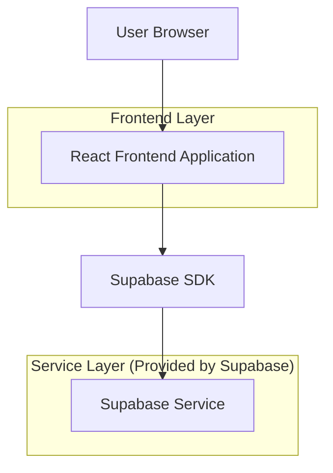
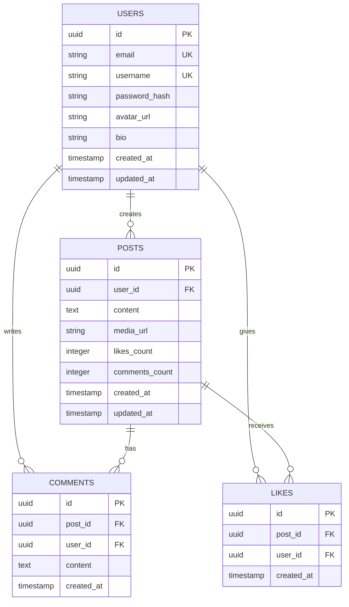

## 1. Architecture Design



## 2. Technology Description
- Frontend: React@18 + tailwindcss@3 + vite
- Initialization Tool: vite-init
- Backend: Supabase (Authentication, Database, Storage)
- State Management: React Context API
- Navigation: React Router DOM

## 3. Route Definitions
| Route | Purpose |
|-------|---------|
| / | Home page, displays main feed with posts |
| /search | Search and discover page for finding content |
| /create | Content creation page for new posts |
| /notifications | Notifications page showing user activity |
| /profile | User profile page with personal information |

## 4. API Definitions

### 4.1 Authentication API
```
POST /auth/v1/token
```

Request:
| Param Name | Param Type | isRequired | Description |
|------------|------------|------------|-------------|
| email | string | true | User email address |
| password | string | true | User password |

Response:
| Param Name | Param Type | Description |
|------------|------------|-------------|
| access_token | string | JWT token for authenticated requests |
| refresh_token | string | Token for refreshing access |
| user | object | User profile information |

### 4.2 Posts API
```
GET /rest/v1/posts
```

Response:
| Param Name | Param Type | Description |
|------------|------------|-------------|
| id | uuid | Unique post identifier |
| user_id | uuid | Author user ID |
| content | text | Post text content |
| media_url | string | URL to media attachment |
| created_at | timestamp | Post creation time |
| likes_count | integer | Number of likes |
| comments_count | integer | Number of comments |

### 4.3 Create Post API
```
POST /rest/v1/posts
```

Request:
| Param Name | Param Type | isRequired | Description |
|------------|------------|------------|-------------|
| content | string | false | Post text content |
| media_url | string | false | Media file URL |
| user_id | uuid | true | Author user ID |

## 5. Data Model

### 5.1 Data Model Definition


### 5.2 Data Definition Language

Users Table (users)
```sql
-- create table
CREATE TABLE users (
    id UUID PRIMARY KEY DEFAULT gen_random_uuid(),
    email VARCHAR(255) UNIQUE NOT NULL,
    username VARCHAR(50) UNIQUE NOT NULL,
    password_hash VARCHAR(255) NOT NULL,
    avatar_url TEXT,
    bio TEXT,
    created_at TIMESTAMP WITH TIME ZONE DEFAULT NOW(),
    updated_at TIMESTAMP WITH TIME ZONE DEFAULT NOW()
);

-- create index
CREATE INDEX idx_users_email ON users(email);
CREATE INDEX idx_users_username ON users(username);
```

Posts Table (posts)
```sql
-- create table
CREATE TABLE posts (
    id UUID PRIMARY KEY DEFAULT gen_random_uuid(),
    user_id UUID REFERENCES users(id) ON DELETE CASCADE,
    content TEXT,
    media_url TEXT,
    likes_count INTEGER DEFAULT 0,
    comments_count INTEGER DEFAULT 0,
    created_at TIMESTAMP WITH TIME ZONE DEFAULT NOW(),
    updated_at TIMESTAMP WITH TIME ZONE DEFAULT NOW()
);

-- create index
CREATE INDEX idx_posts_user_id ON posts(user_id);
CREATE INDEX idx_posts_created_at ON posts(created_at DESC);
```

Comments Table (comments)
```sql
-- create table
CREATE TABLE comments (
    id UUID PRIMARY KEY DEFAULT gen_random_uuid(),
    post_id UUID REFERENCES posts(id) ON DELETE CASCADE,
    user_id UUID REFERENCES users(id) ON DELETE CASCADE,
    content TEXT NOT NULL,
    created_at TIMESTAMP WITH TIME ZONE DEFAULT NOW()
);

-- create index
CREATE INDEX idx_comments_post_id ON comments(post_id);
CREATE INDEX idx_comments_user_id ON comments(user_id);
```

Likes Table (likes)
```sql
-- create table
CREATE TABLE likes (
    id UUID PRIMARY KEY DEFAULT gen_random_uuid(),
    post_id UUID REFERENCES posts(id) ON DELETE CASCADE,
    user_id UUID REFERENCES users(id) ON DELETE CASCADE,
    created_at TIMESTAMP WITH TIME ZONE DEFAULT NOW(),
    UNIQUE(post_id, user_id)
);

-- create index
CREATE INDEX idx_likes_post_id ON likes(post_id);
CREATE INDEX idx_likes_user_id ON likes(user_id);
```

### 5.3 Row Level Security Policies
```sql
-- Enable RLS
ALTER TABLE posts ENABLE ROW LEVEL SECURITY;
ALTER TABLE comments ENABLE ROW LEVEL SECURITY;
ALTER TABLE likes ENABLE ROW LEVEL SECURITY;

-- Grant permissions
GRANT SELECT ON posts TO anon;
GRANT ALL ON posts TO authenticated;
GRANT SELECT ON comments TO anon;
GRANT ALL ON comments TO authenticated;
GRANT SELECT ON likes TO anon;
GRANT ALL ON likes TO authenticated;

-- Create policies
CREATE POLICY "Posts are viewable by everyone" ON posts FOR SELECT USING (true);
CREATE POLICY "Users can insert their own posts" ON posts FOR INSERT WITH CHECK (auth.uid() = user_id);
CREATE POLICY "Users can update their own posts" ON posts FOR UPDATE USING (auth.uid() = user_id);
CREATE POLICY "Users can delete their own posts" ON posts FOR DELETE USING (auth.uid() = user_id);
```